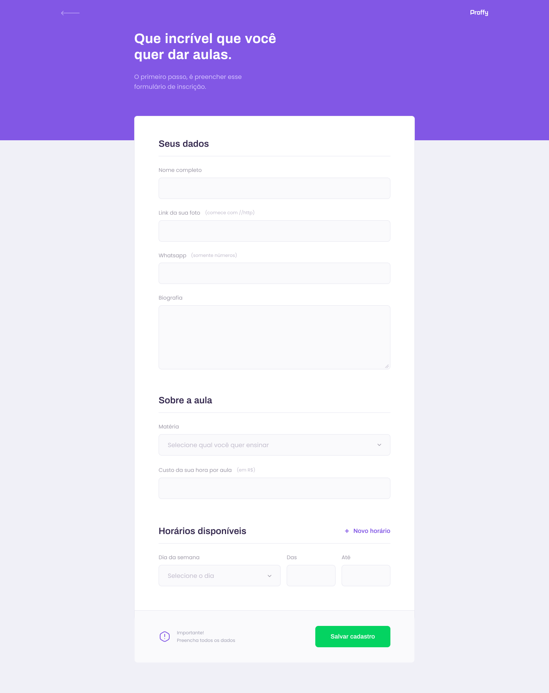

<!-- VARS -->

[logo-url]: https://camo.githubusercontent.com/74c8681f6d4521903b63e79173a72f0b849243be/68747470733a2f2f692e696d6775722e636f6d2f73356c546465502e706e67
[web-badge]: https://img.shields.io/badge/WEB-6842C2?logo=typescript&logoColor=47248F&label=Proffy&labelColor=6842C2&style=for-the-badge
[backend-badge]: https://img.shields.io/badge/BACKEND-04D361?logo=Node.js&logoColor=03A14A&label=Proffy&labelColor=04D361&style=for-the-badge
[mobile-badge]: https://img.shields.io/badge/MOBILE-494949?logo=react&logoColor=161616&label=Proffy&labelColor=494949&style=for-the-badge

<!-- VARS -->

<div align="center">

# ![Proffy][logo-url]

### Plataforma de estudos online, onde é possivel conectar alunos com professores.

[![web][web-badge]](#desktop_computer-web)
[![backend][backend-badge]](#globe_with_meridians-server)
[![mobile][mobile-badge]](#iphone-mobile)


</div>

---

O Proffy é um projeto que esta sendo desenvolvido durante a **Next Level Week #2** da [@Rocketseat](https://github.com/Rocketseat), durante os dias _3 à 7 de Agosto de 2020_.

Este projeto esta sendo codado na trilha OmniStack, que desenvolve a stack JavaScript completa, do zero, criando as versões Web, Mobile e Back-End da aplicação.

> [Anotações - NOTES.md](NOTES.md)

---

<div align="center">

# :desktop_computer: _**WEB**_

</div>

A versão web da aplicação fei desenvolvida usando a metodologia _mobile first_, em que a aplicação é pensada primeiramente para dispositivos mobile, e depois é adaptada para dispositivos desktops.

Foi usada as tecnologias [**React**](https://reactjs.org/) e [**Typescript**](https://www.typescriptlang.org/) para o desenvolvimento da aplicação web.


 

> O código fonta da aplicação web esta na pasta

## :arrow_forward: **Getting Started**

Entre na pasta [`web/`](web/) e execute os seguintes comandos:

_com **npm**_

```bash
# Instalar dependências
$ npm install

# Iniciar servidor de desenvolvimento
$ npm start
```

_com **yarn**_

```bash
# Instalar dependências
$ yarn

# Iniciar servidor de desenvolvimento
$ yarn start
```

> O servidor de desenvolvimento fica aberto por padrão em [`http://localhost:3000`](http://localhost:3000)

Gerar código de produção

_com **npm**_

```bash
$ npm build
```

_com **yarn**_

```bash
$ yarn build
```

> O código fica salvo em [`build/`](web/build)

<div align="center">

# :iphone: _**Mobile**_

</div>

O aplicação mobile foi desenvolvida usando o framework [**React Native**](https://reactnative.dev/) com [**Typescript**](https://www.typescriptlang.org/), e a _SDK 38_ da ferramenta [**Expo**](https://expo.io/).

Home | Study | Favorites
---|---|---
|  |  |  |

## :arrow_forward: **Getting Started**

Entre na pasta [`mobile/`](mobile/) e execute os seguintes comandos:

_com **npm**_

```bash
# Instalar expo-cli globalmente
$ npm install expo-cli --global

# Instalar dependências
$ npm install

```

_com **yarn**_

```bash
# Instalar expo-cli globalmente
$ yarn global add expo-cli

# Instalar dependências
$ yarn

```

Iniciar DevTools do expo

```bash
$ expo start
```

> O DevTools do Expo fica aberto por padrão em [`http://localhost:19002`](http://localhost:19002)

<div align="center">

# :globe_with_meridians: _**Server**_

</div>

O servidor da aplicação foi desenvolvido seguindo a metodologia _API Rest_ para poder ser reaproveitada tanto na web quando em dispositivos mobile.

Foi usada as tecnologias [**NodeJS**](https://nodejs.org/) com [**Typescript**](https://www.typescriptlang.org/), banco de dados [**SQLite3**](https://sqlite.org/) com query builder [**Knex**](http://knexjs.org/), e o framework [**Express**](http://expressjs.com/), no desenvolvimento da API Rest.

## :pencil2: Funcionalidades

### Conexões

- _Rota para lista o total de conexões realisadas._
- _Rota para criar uma nova conexão._

### Aulas

- _Rota para criar uma aula._
- _Rota para listar aulas._
  - _Filtrar por matéria, dia da semana, e horário._

## :arrow_forward: **Getting Started**

Entre na pasta [`server/`](server/) e execute os seguintes comandos:

_com **npm**_

```bash
# Instalar dependências
$ npm install

# Criar database
$ npm knex:migrate

# Iniciar servidor
$ npm start
```

_com **yarn**_

```bash
# Instalar dependências
$ yarn

# Criar banco de dados
$ yarn knex:migrate

# Iniciar servidor de desenvolvimento
$ yarn start
```

> O Banco de Dados fica salvo em [`src/database/database.sqlite`](src/database/database.sqlite)

> O endereço padrão do servidor Node é [`http://localhost:3333`](http://localhost:3333)

---

<div align="center">

      

<table>
  <tr align="center">
    <td>Coded By</td><td>Instrutor</td>
  </tr>
  <tr align="center">
    <td>
      <a href="https://github.com/mateusfg7">
        
      </a>
    </td>
    <td>
      <a href="https://github.com/diego3g">
        
      </a>
    </td>
  </tr>
</table>

</div>
