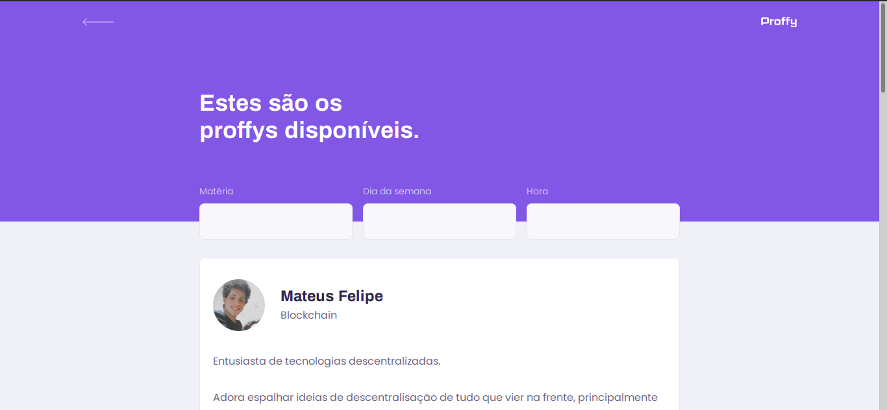

<div align="center">

# 

### _Versão **WEB**_

A versão web da aplicação fei desenvolvida usando a metodologia _mobile first_, em que a aplicação é pensada primeiramente para dispositivos mobile, e depois é adaptada para dispositivos desktops.

Foi usada as tecnologias [**React**](https://reactjs.org/) e [**Typescript**](https://www.typescriptlang.org/) para o desenvolvimento da aplicação web.

_home_


_study page_




</div>

---

## Instalar dependencias

_yarn_

```bash
$ yarn
```

_npm_

```bash
$ npm install
```

## Iniciar aplicação

_yarn_

```bash
$ yarn start
```

_npm_

```bash
$ npm start
```

---

<div align="center">


<table>
  <tr align="center">
    <td>Coded By</td><td>Instrutor</td>
  </tr>
  <tr align="center">
    <td>
      <a href="https://github.com/mateusfg7">
        
      </a>
    </td>
    <td>
      <a href="https://github.com/diego3g">
        
      </a>
    </td>
  </tr>
</table>

</div>
